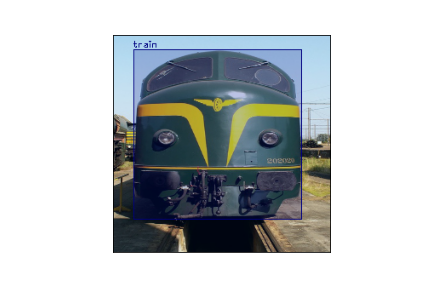

# CornerNet Implementation in Pytorch-Lightning

CornerNet is a new approach to object detection where we detect an object bounding box as a pair of keypoints (top-left corner and bottom-right corner)

This repo contains implementation of CornerNet in Pytorch-Lightning 

[Paper](https://arxiv.org/abs/1808.01244)

## Results

<table>
  <tr>
    <td> </td>
    <td> </td>
  </tr> 
   <tr>
    <td> </td>
    <td> </td>
  </tr> 
  <tr>
    <td> </td>
    <td> </td>
  </tr>
</table>


## Getting started 

### Requirements

- pytorch 1.9.1
- kornia
- cornerpool
- pytorch-lightning
- tqdm

### Clone this Repo
```bash
CornerNet_ROOT=/path/to/clone/CornerNet
git clone https://github.com/Jovian-Dsouza/CornerNet.git $CornerNet_ROOT
```

### Dataset
Downlaod the Pascal voc dataset 

### Train 
```
python train_pl.py
```

### Evaluate 
```
python evaluate.py
```

## References

[zzzxxxttt/pytorch_simple_CornerNet](https://github.com/zzzxxxttt/pytorch_simple_CornerNet)

[princeton-vl/CornerNet](https://github.com/princeton-vl/CornerNet)